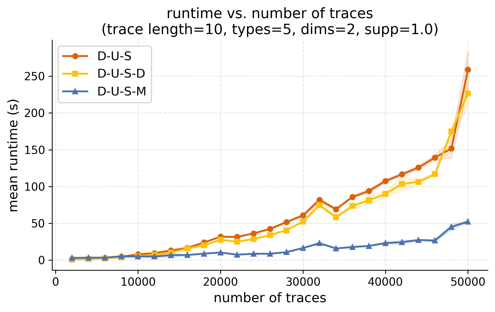
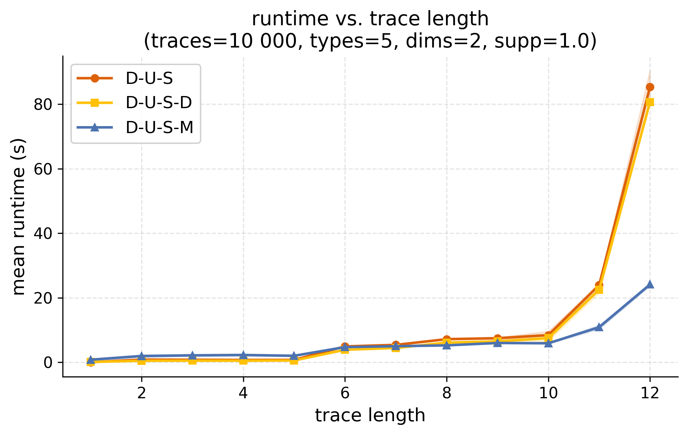
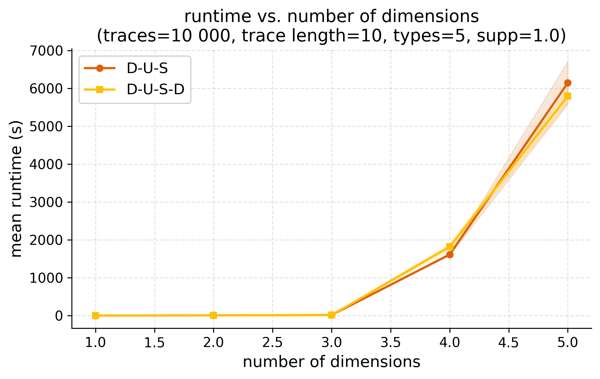
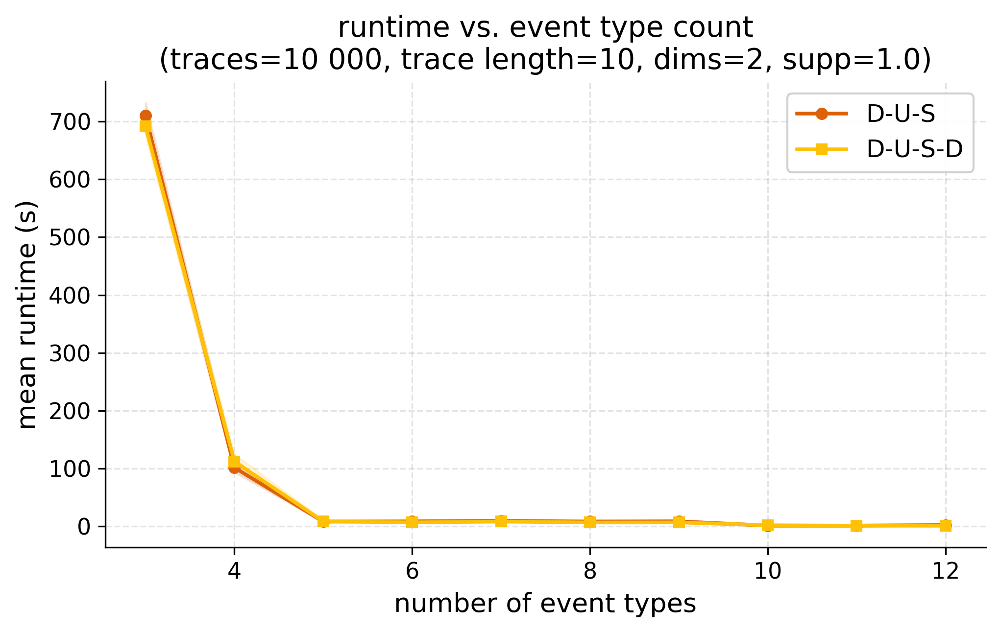
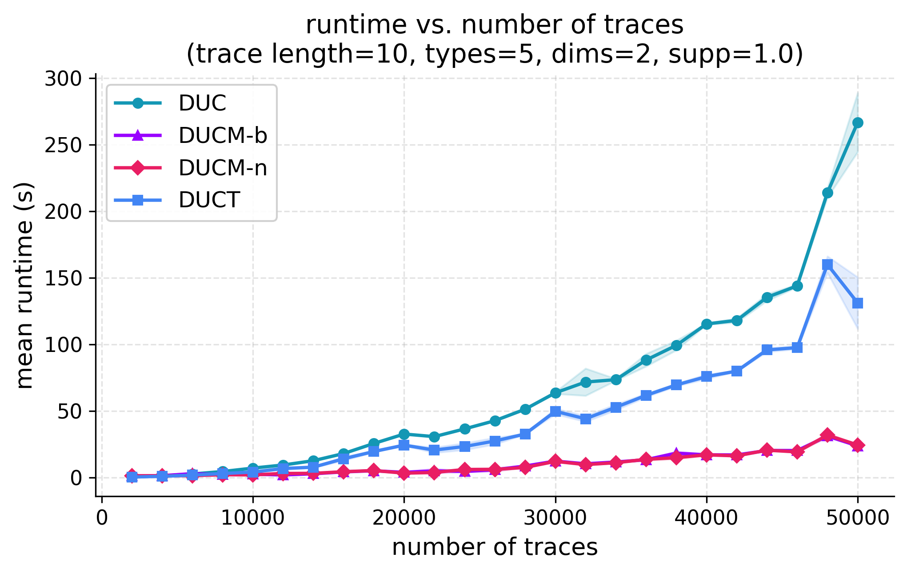
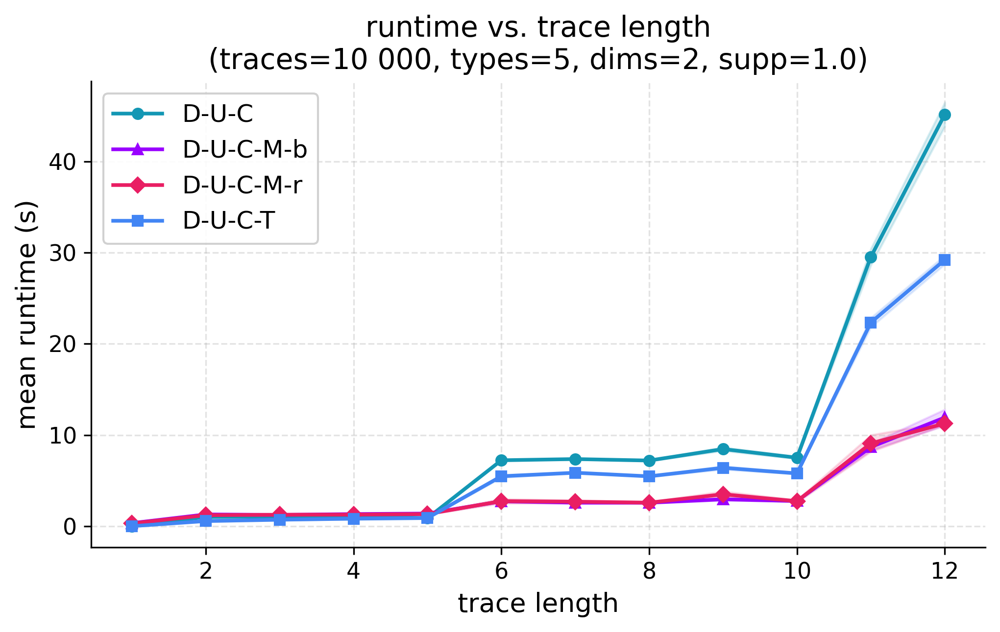
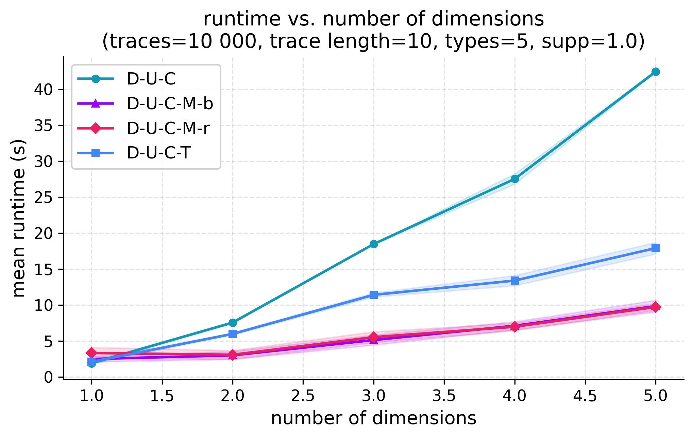
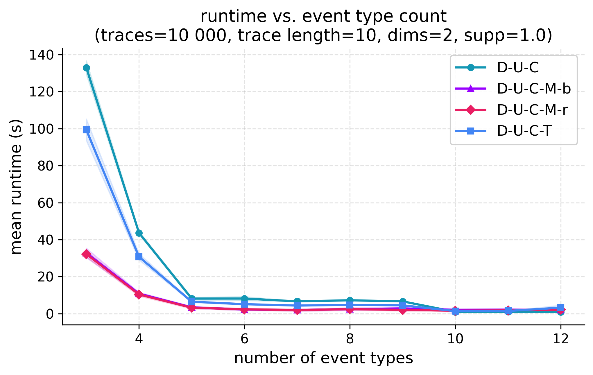
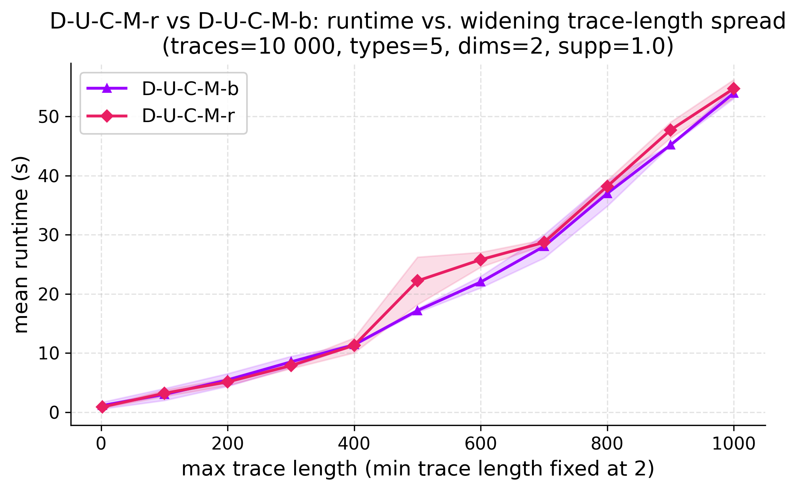

# DISCES
## Setup
1. Create the python environment: 
```bash
python3 -m venv venv && source venv/bin/activate
```
2. Install the dependencies:
```bash
pip install -r requirements.txt
```
3. The code can then be run via the terminal:
```bash
python run_comparison.py --sample-size 5000 --min-trace-length 10 --max-trace-length 10 --dimensions 2 --type-count 5
```

- `--sample_size` = number of traces
- `--min-trace-length` = minimum length of traces (default: 10)
- `--max-trace-length` = maximum length of traces (default: 10)
- `--dimensions` = number of different attributes
- `--type-count` = number of possible values per attribute

## Algorithms
We distributed the basic DUC and DUS Algorithm in 5 different Versions:

### DUCT (DUC-Tree)
We distribute the search across this first level, assigning each branch to a separate worker to be explored independently, and combine the results at the end.

### DUCM (DUC-Matching)
We partition the traces across workers, so that each worker performs the match operation on its own subset of streams.

- **D-U-C-M-r (DUC-Matching-random)**: Implements random partitioning. Traces are split into contiguous chunks in their original order.
- **D-U-C-M-b (DUC-Matching-balanced)**: Implements length-based partitioning. Traces are sorted longest-first and greedily assigned to whichever worker currently has the smallest total trace length, so each worker's total workload stays balanced. Within each worker's chunk, traces are then evaluated shortest-first.

### DUSD (DUS-Dimension)
We distribute the per-attribute trees across workers so they are explored in parallel, then perform the merging sequentially once all trees are complete.

### DUSM (DUS-Matching)
We explore the per-attribute trees in sequence with DUCM in each tree, then we partition the traces across workers, so that each worker performs the match operation during the merging on its own subset of streams.

## Online Streaming Setting
If you want to execute our naive online straming setting run
```bash
python3 src/online_ducm.py
```

## Benchmarks
Figures are generated by `notebooks/generate_figures_dus.ipynb` and `notebooks/generate_figures_duc.ipynb`, reading benchmark data produced by `notebooks/benchmark.ipynb`.

### DUS
<table>
<tr>
<td></td>
<td></td>
</tr>
<tr>
<td></td>
<td></td>
</tr>
</table>

### DUC
<table>
<tr>
<td></td>
<td></td>
</tr>
<tr>
<td></td>
<td></td>
</tr>
<td></td>
</table>